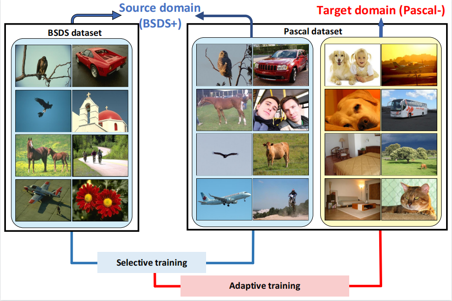
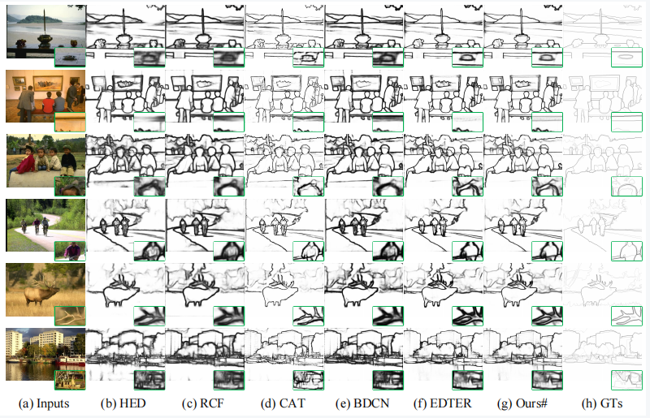
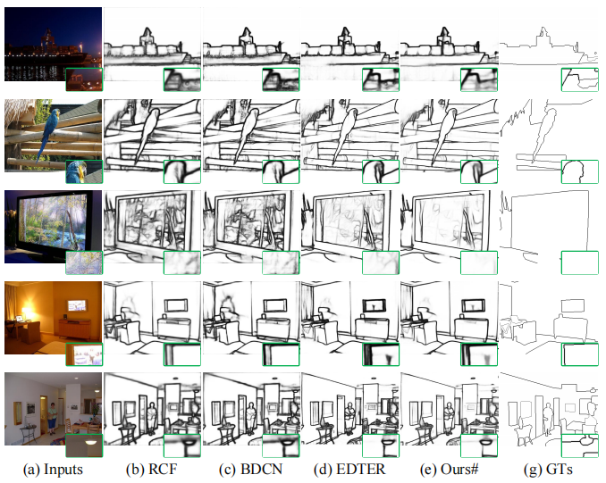

# How to Use Extra Training Data for Better Edge Detection?


## Introduction
This repository is an official implementation of paper [How to Use Extra Training Data for Better Edge Detection?]().



**Abstract.** 
## News
(15/03/2023) Upload codes and models. 

### Datasets
#### BSDS500
Download the augmented BSDS500 data from [here](http://vcl.ucsd.edu/hed/HED-BSDS.tar).<br/>
```
|-- data
    |-- BSDS
        |-- ImageSets
        |   |-- train_pair.txt
        |   |-- test.txt
        |   |-- pascal_train_pair.txt
        |-- train
        |   |-- aug_data
        |   |-- aug_data_scale_0.5
        |   |-- aug_data_scale_1.5
        |   |-- aug_gt
        |   |-- aug_gt_scale_0.5
        |   |-- aug_gt_scale_1.5
        |-- test
        |   |-- 2018.jpg
        ......
```
#### NYUD
Download the augmented NYUD data from [baidu(1234)](https://pan.baidu.com/s/1L2VMVtRYUctLpCubMhFvhw).<br/>
```
|-- data
    |-- NYUD
        |-- ImageSets
        |   |-- train_pair.txt
        |   |-- test.txt
        |-- train
        |   |-- HHA
        |   |-- HHA_05
        |   |-- HHA_15
        |   |-- GT
        |   |-- GT_05
        |   |-- GT_15
        |   |-- Images
        |   |-- Images_05
        |   |-- Images_15
        |-- test
        |   |-- Images
        |   |-- GT
        ......
```
#### BSDS+、Pascal-、Split_data、Pascal dataset
Download the BSDS+ training data from [baidu(mo8f)](https://pan.baidu.com/s/18BovnitenwCrdYkE1JLltw?pwd=mo8f).<br/>
Download the Pascal- training data from [baidu(15d2)](https://pan.baidu.com/s/1c55qGxc1mzTLzSf7FwQJ8w?pwd=15d2).<br/>
Download the Split_data data from [baidu(hsfj)](https://pan.baidu.com/s/16MZRO5mHzDRa5MS5dYacvg?pwd=hsfj).<br/>
Download the Pascal dataset from [baidu(1234)](https://pan.baidu.com/s/1yQFOem4b1DHjMerD2I-eow).<br/>

### Pre-trained model
If you are unable to download due to network reasons, you can download the pre-trained model from 
[baidu(1234)](https://pan.baidu.com/s/1NcweqeAhAXbn3yTkaXC1dw) 
and 
[baidu(1234)](https://pan.baidu.com/s/1lLfeSjrxuY5yMLaL1RE1NA).

###  Training EDTER
#### The training of Stage I
```shell
./tools/dist_train.sh ${CONFIG_FILE} ${GPU_NUM} 
# For example, train Stage I on BSDS500 dataset with 8 GPUs
./tools/dist_train.sh configs/bsds/EDTER_BIMLA_320x320_80k_bsds_bs_8.py 8
```

### Testing
#### Single-scale testing
Change the '--config', '--checkpoint', and '--tmpdir' in [test.py](https://github.com/MengyangPu/EDTER/blob/main/tools/test.py).
```shell
python test.py
```

## Results
| **Method**  | **Dataset** | **ODS** | **OIS** | **AP** |
|:-----------:|:-----------:|:-------:|:-------:|:------:|
| Boosting-ED |    BSDS     |  0.837  |  0.854  | 0.890  |
| Boosting-ED |    NYUD     |  0.778  |  0.793  | 0.801  |
| Boosting-ED |   Pascal    |  0.668  |  0.683  | 0.690  |
 


## Requirements
* Windows, Python>=3.6, CUDA>=11.0, pytorch >= 1.7.1
* Windows, Python>=3.6, CUDA>=11.0, pytorch >= 1.7.1

## Installation
* git clone https://github.com/wenya1994/Boosting-ED.git
* cd Boosting-ED

## Performance
We provide some visualization results as follows to show our superiority.



## Contacts
If you have any question about our work or this repository, please don't hesitate to contact us by emails.
- [yangwenya@hdu.edu.cn]
- [wuwen.hdu.cs@gmail.com]


## Acknowledgments
- We thank the anonymous reviewers for valuable and inspiring comments and suggestions.
- Thanks to previous open-sourced repo:<br/>
  [EDTER](https://github.com/MengyangPu/EDTER)<br/>

## Cite
```
```
